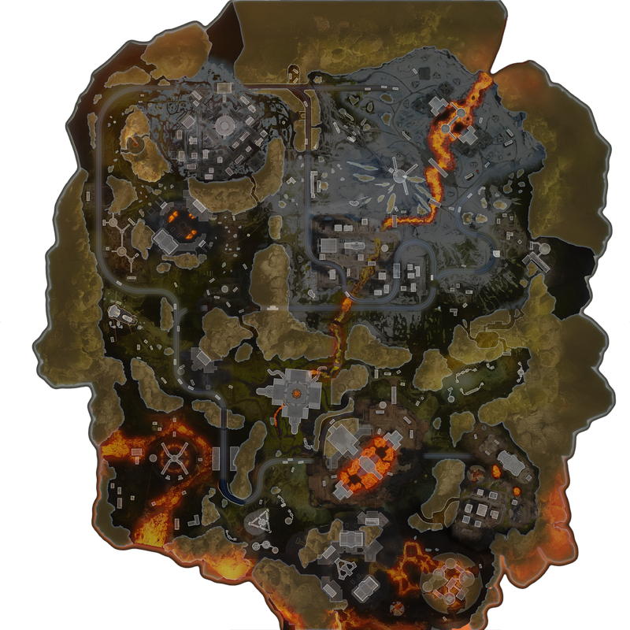
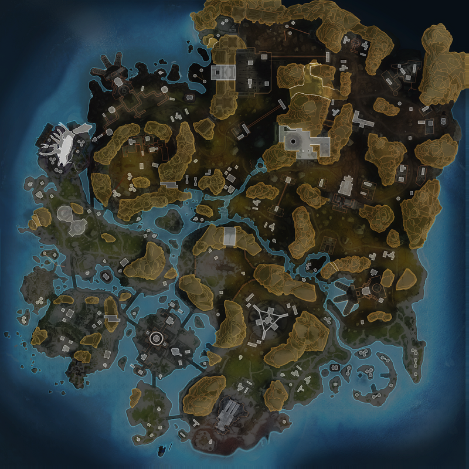

```{r setup, include=FALSE}
knitr::opts_chunk$set(echo = TRUE)
```

# Introduction

Similar to movies in my previous capstone, Apex Legends is a video game that is very close to my heart. Recently, my brother had the amazing opportunity to pursue a new job in Charlotte, North Carolina, far away from where I currently live. Apex Legends is one way that I get to spend time with my brother, usually on a weekly basis. I always look forward to the time I get to start up a match and just chat with my brother (the game is fun, too). This is why I chose to investigate an aspect of Apex Legends that can possibly be predicted by machine learning. While I know this will not make me better at the game, I still look forward to learning and building something around a special aspect of my life. Through this capstone, I will explain what exactly Apex Legends is, find match data for Apex Legend's main method of gameplay and tidy said data, and create a model to predict the final state of Apex Legends games.

## Motivation

Recently, the company I currently work for put me in an interesting (albeit awkward) position by announcing that I am out of a job by the end of this year. Not one to mope and stand idly by, I took it upon myself to teach myself something new and prepare myself for the next adventure just over the horizon. I find life at its most exciting when I am in the midst of a challenge where I can push through and come out better at the other end. Thus, I decided to participate in the HarvardX: PH125.9x - Data Science program to hone new skills, including but not limited to the R programming language, data science and analysis, and machine learning. 

## Overview

Apex Legends[@ApexLegends_About] is a competitive, online first person shooter (FPS) video game developed by Respawn Entertainment and published by Electronic Arts. In Apex Legends, you select a character from a growing cast, each with their own unique passive ability, tactical ability (an ability you can use frequently), and an ultimate ability (a powerful ability you can use infrequently) to beat the other teams (called squads) at some objective, using the vast arsenal of weapons and tools provided to you during each match. While I am not very good at the game yet, I do like to play the character Valkyrie[@ApexLegends_Characters].

While there are many modes of gameplay in Apex (in fact, Respawn Entertainment likes to experiment with different rules, maps, mechanics, etc.), the original mode and focus of this capstone project is the battle royale mode[@ApexLegends_BattleRoyale]. In battle royale, your squad of three players work together on one big map to eliminate the other nineteen squads (for 60 players total) before they cut you and your teammates out of the game. You can eliminate another player by dealing damage equal to or exceeding their character's health pool plus whatever armor their character might have found and put on during the match. Over the course of the game, a ring closes in on the map, which will deal damage to any player outside of its boundaries, with the purpose of forcing squads closer and closer together, until the ring encompasses everything, putting a final timer on the match. Each match of battle royale has five distinct rings, with the match starting with no ring and ending with the ring covering everything. The five rounds of the ring transition between states at a set period of time within each match and deal different amounts of damage to players to put a timebox on the game. You can see the ring information as shown below[@ccamfpsApex]:

| Round | Time to wait | Time to close | Damage per tick | Ring diameter after closing |
| :--- | :--- | :--- | :--- | :--- |
| 1 | 3 minutes | 3 minutes 45 seconds | 2 | 1000 meters |
| 2 | 2 minutes 45 seconds | 45 seconds | 3 | 650 meters |
| 3 | 2 minutes 15 seconds | 45 seconds | 10 | 400 meters |
| 4 | 1 minute 45 seconds | 40 seconds | 20 | 200 meters |
| 5 | 1 minute 30 seconds | 40 seconds | 20 | 100 meters |
| 6 | 1 minute | 2 minutes | 25 | 0.05 meters |

In this capstone project, I would like to see if I can use machine learning through R and the `CAReT`[@caret], or Classification and Regression Training, package to predict where the final ring will end on a map. While there are also several different maps that put varying points of interest (POI) and obstacles in your path to achieving victory[@ApexLegends_BattleRoyale_Maps], this capstone project will only focus on two: World's Edge and Storm Point.

```{r, echo = FALSE, message = FALSE, warning = FALSE, eval = TRUE, fig.cap = "World's Edge Map", out.width = "100%"}

```

```{r, echo = FALSE, message = FALSE, warning = FALSE, eval = TRUE, fig.cap = "Storm Point Map", out.width = "100%"}

```

# Data and Analysis

## Set Up

Throughout this capstone project I will use a number of R packages, including the previously mentioned `caret`[@caret] package. I will use the `jsonlite`[@jsonlite] and the `tidyverse`[@tidyverse] packages for data manipulation, and the `ggplot2`[@ggplot2], `ggforce`[@ggforce], `ggimage`[@ggimage], `gganimate`[@gganimate], and `gridExtra`[@gridextra] packages for visualizing data.

```{r, echo = FALSE, message = FALSE, warning = FALSE, eval = TRUE}
if (!require(renv))
  install.packages("renv", repos = "http://cran.us.r-project.org")
if (!require(jsonlite))
  install.packages("jsonlite", repos = "http://cran.us.r-project.org")
if (!require(tidyverse))
  install.packages("tidyverse", repos = "http://cran.us.r-project.org")
if (!require(caret))
  install.packages("caret", repos = "http://cran.us.r-project.org")
if (!require(ggplot2))
  install.packages("ggplot2", repos = "http://cran.us.r-project.org")
if (!require(ggforce))
  install.packages("ggforce", repos = "http://cran.us.r-project.org", dependencies = TRUE)
if (!require(ggimage))
  install.package("ggimage", repos = "http://cran.us.r-project.org")
if (!require(gganimate))
  install.packages("gganimate", repos = "http://cran.us.r-project.org")
if (!require(gridExtra))
  install.packages("gridExtra", repos = "http://cran.us.r-project.org")

library(renv)
library(jsonlite)
library(tidyverse)
library(caret)
library(ggplot2)
library(ggforce)
library(ggimage)
library(gganimate)
library(gridExtra)

# Download the png file to the "images" directory
worlds_edge_image_file <- "images/worlds_edge_map.png"
if(!file.exists(worlds_edge_image_file))
  download.file(
    paste0(
      "https://static.wikia.nocookie.net/",
      "apexlegends_gamepedia_en/images/",
      "4/4f/World%27s_Edge_MU4.png/",
      "revision/latest/scale-to-width-down/800?cb=20230513185802"
    ),
    worlds_edge_image_file,
    mode = "wb"
  )
# Download the png file to the "images" directory
storm_point_image_file <- "images/storm_point_map.png"
if(!file.exists(storm_point_image_file))
  download.file(
    paste0(
      "https://static.wikia.nocookie.net/",
      "apexlegends_gamepedia_en/images/",
      "5/56/Storm_Point_MU1.png/",
      "revision/latest/scale-to-width-down/800?cb=20220511235629"
    ),
    storm_point_image_file,
    mode = "wb"
  )
```

## Initial Data

To start off this capstone project, I was not given any sort of initial data this time around. Instead, I had to go on the hunt for enough Apex Legends match data that I could create a model using said data. I found a GitHub repository, owned and maintained by the user `bluelightgit`[@bluelightgit] that had Apex Legends match data that fit the bill. The match data in question was stored in JSON (JavaScript Object Notation) format. This is slightly different than the CSV (Comma Separated Values) format that we worked with during the HarvardX Data Science course, but I am used to working with JSON data, being a software developer. The `jsonlite`[@jsonlite] R package makes it very easy to import JSON data. Using the R code shown below, I download the JSON data and store it in my data directory, import the JSON data into R, then transform the JSON data into a tibble.

```{r, echo = TRUE, message = FALSE, warning = FALSE, eval = TRUE}
# Download the json file to the "data" directory
json_file <- "data/apex.json"
if(!file.exists(json_file))
  download.file(
    paste0(
      "https://raw.githubusercontent.com/",
      "bluelightgit/apex-zone-predict-machine-learning/",
      "main/zone_datas/zones_data.json"
    ),
    json_file
  )

# Read and parse the json data
json_data <- fromJSON(json_file)

# Transform the json data into a tibble
apex_data <- as_tibble(json_data)

# Save the apex data to an RData file
save(apex_data, file = "rda/apex_data.rda")

head(apex_data)
```

## Pre-Processing

Before I continue to analyzing the data, I am first going to perform some pre-processing on the Apex Legends match data. Throughout the course of this capstone project, I am going to work with the match data represented in two different ways:

1. A long format, which is easier to use when visualizing data, and
2. A wide format, which is easier to use when training and evaluating the model I am going to create.

### Long Data

Firstly, I want to tidy up the Apex Legends match data, which will make viewing the data but also make creating the wide data much easier in the long run. In the long representation of the Apex Legends match data, each row will correspond to a stage of the ring, meaning each game will have five rows.

1. Currently, the x and y coordinates of each stage of the ring within each game in the data set are nested within their own data frame. To make the x and y coordinates easier to access, I want to bring them out from their own nested data frame and into each row.
2. The `map` column is not very human-readable at the moment, with `we` corresponding to `World's Edge` and `sp` corresponding to `Storm Point`. I want to convert the `map` column into a factor and also change the name of said factors to be very clear what map each row matches with.
3. Speaking of factors, I will also make the `stage` and `gameID` columns factors.

```{r, echo = TRUE, message = FALSE, warning = FALSE, eval = TRUE}
# Copy the apex data to a new variable for manipulation
apex_data_tidy <- apex_data
# Bring the x and y coordinates of the ring out from a nested data frame
# and into their own columns in the data set
apex_data_tidy <- apex_data_tidy %>%
  mutate(x = center$x, y = center$y) %>%
  select(-center)
# Rename "we" to "World's Edge" and "sp" to "Storm Point" respectively
# Make the "map" column values factors
apex_data_tidy <- apex_data_tidy %>%
  mutate(map = as.factor(ifelse(map == "we", "World's Edge", "Storm Point")))
# Make the "stage" and "gameID" column values factors
apex_data_tidy <- apex_data_tidy %>%
  mutate(stage = as.factor(stage), gameID = as.factor(gameID))

# Save the tidy apex data to an RData file
save(apex_data_tidy, file = "rda/apex_data_tidy.rda")
```

After cleaning up the Apex Legends match data a little bit, there is also some information that I would like to calculate and represent in the data, which I believe will be helpful later on when creating the model for predicting the final ring state in a match.

1. The distance between each ring stage, calculated like so:

$$ \sqrt{(x_{i+1} - x_i)^2 + (y_{i+1} - y_i)^2} $$
where $i$ represents the ring stages, 1 through 5 (0 being the ring stage where there is no ring on the map).

2. The angle between each ring stage, calculated like so:

$$ \arctan{m_i} $$
where $m$ is the slope of the line drawn between the ring stages and $i$ represents the ring stages, 1 through 5 (0 being the ring stage where there is no ring on the map).

```{r, echo = TRUE, message = FALSE, warning = FALSE, eval = TRUE}
# Copy the tidy apex data to a new variable for further manipulation
apex_data_long <- apex_data_tidy

# Create and populate a new variable with 0
distance_between <- rep(0.0, nrow(apex_data_long))

# For each ring (and the ring to follow),
# if the current ring is not either
# 1. the ring that does not display (ring 0)
# 2. or the last ring of the match (ring 5)
# then calculate the distance between the two ring stages
for (current_ring in 1:nrow(apex_data_long)) {
  if (
    apex_data_long[current_ring,]$stage != 0 |
    apex_data_long[current_ring,]$stage != 5
  ) {
    distance_between[current_ring] <-
      sqrt(
        (
          apex_data_long[current_ring + 1,]$x -
            apex_data_long[current_ring,]$x
        )^2 +
          (
            apex_data_long[current_ring + 1,]$y -
              apex_data_long[current_ring,]$y
          )^2
      )
  }
}

# Transform any NaN into 0
distance_between[is.nan(distance_between)] <- 0

# Add the new information to the apex_data_long data set
apex_data_long <- apex_data_long %>%
  mutate(distance_between = distance_between)

# Create and populate a new variable with 0
angle_between <- rep(0.0, nrow(apex_data_long))

# For each ring (and the ring to follow),
# if the current ring is not either
# 1. the ring that does not display (ring 0)
# 2. or the last ring of the match (ring 5)
# then calculate the angle between the two ring stages
for (current_ring in 1:nrow(apex_data_long)) {
  if (
    apex_data_long[current_ring,]$stage != 0 |
    apex_data_long[current_ring,]$stage != 5
  ) {
    angle_between[current_ring] <-
      atan(
        (
          apex_data_long[current_ring + 1,]$y -
            apex_data_long[current_ring,]$y
        ) /
          (
            apex_data_long[current_ring + 1,]$x -
              apex_data_long[current_ring,]$x
          )
      )
  }
}

# Transform any NaN into 0
angle_between[is.nan(angle_between)] <- 0

# Add the new information to the apex_data_long data set
apex_data_long <- apex_data_long %>%
  mutate(angle_between = angle_between)

# Save the long apex data to an RData file
save(apex_data_long, file = "rda/apex_data_long.rda")
```

### Wide Data

Next, I want to create a wide representation of the Apex Legends match data, which I will use when training and evaluating the model for predicting the final ring location on a map. To do this, I will mutate the data set with similar information to the long representation of the data, but I will also make use of the `pivot_wider` function.

```{r, echo = TRUE, message = FALSE, warning = FALSE, eval = TRUE}
# Helper function to account for any NaN encountered within a data.frame
is.nan.data.frame <- function(df)
  do.call(cbind, lapply(df, is.nan))

# Copy the tidy apex data to a new variable for further manipulation
apex_data_wide <- apex_data_tidy
# Make a wide representation of the data set
# by making each row represent one whole game
# with all ring stage coordinates represented by their own columns
apex_data_wide <- apex_data_wide %>%
  filter(map == "World's Edge") %>%
  pivot_wider(
    names_from = stage,
    values_from = c(x, y, radius)
  ) %>%
  mutate(
    distance_from_center_1 =
      sqrt((x_1 - mean(apex_data_wide$x))^2 + (y_1 - mean(apex_data_wide$y))^2),
    distance_between_1_and_2 =
      sqrt((x_2 - x_1)^2 + (y_2 - y_1)^2),
    angle_between_1_and_2 =
      atan((y_2 - y_1) / (x_2 - x_1)),
    distance_from_center_2 =
      sqrt((x_2 - mean(apex_data_wide$x))^2 + (y_2 - mean(apex_data_wide$y))^2),
    distance_between_2_and_3 =
      sqrt((x_3 - x_2)^2 + (y_3 - y_2)^2),
    angle_between_2_and_3 =
      atan((y_3 - y_2) / (x_3 - x_2)),
    distance_from_center_3 =
      sqrt((x_3 - mean(apex_data_wide$x))^2 + (y_3 - mean(apex_data_wide$y))^2),
    distance_between_3_and_4 =
      sqrt((x_4 - x_3)^2 + (y_4 - y_3)^2),
    angle_between_3_and_4 =
      atan((y_4 - y_3) / (x_4 - x_3)),
    distance_from_center_4 =
      sqrt((x_4 - mean(apex_data_wide$x))^2 + (y_4 - mean(apex_data_wide$y))^2),
    distance_between_4_and_5 =
      sqrt((x_5 - x_4)^2 + (y_5 - y_4)^2),
    angle_between_4_and_5 =
      atan((y_5 - y_4) / (x_5 - x_4)),
    distance_from_center_5 =
      sqrt((x_5 - mean(apex_data_wide$x))^2 + (y_5 - mean(apex_data_wide$y))^2),
  )

apex_data_wide[is.nan(apex_data_wide)] <- 0

# Save the wide apex data to an RData file
save(apex_data_wide, file = "rda/apex_data_wide.rda")
```

Now each row in this data set represents one game as a whole, with columns corresponding to each x and y coordinate of each stage of the ring.

## Visualizing Apex Legends Matches

Before I continue with the analysis portion of this capstone project, I would like to take a moment  to look at the data I have transformed to see if I can notice any trends or tidbits of information that I might find useful later on when I am conducting machine learning.

```{r, echo = TRUE, message = FALSE, warning = FALSE, eval = TRUE}
# Summarize the radius data across rings on each map
apex_data_long %>%
  group_by(map, stage) %>% # Only compare rings within the same map
  summarize(
    radius_average = mean(radius),
    radius_standard_deviation = sd(radius),
    radius_min = min(radius),
    radius_max = max(radius)
  )

# Summarize the ring area data across rings on each map
apex_data_long %>%
  group_by(map, stage) %>% # Only compare rings within the same map
  summarize(
    area_average = mean(pi * radius^2),
    area_standard_deviation = sd(pi * radius^2),
    area_min = min(pi * radius^2),
    area_max = max(pi * radius^2)
  )

# Summarize the distance between rings data across rings on each map
apex_data_long %>%
  group_by(map, stage) %>% # Only compare rings within the same map
  summarize(
    distance_between_average = mean(distance_between),
    distance_between_standard_deviation = sd(distance_between),
    distance_between_min = min(distance_between),
    distance_between_max = max(distance_between)
  )

# Summarize the angle between rings data across rings on each map
apex_data_long %>%
  group_by(map, stage) %>% # Only compare rings within the same map
  summarize(
    angle_between_average = mean(angle_between),
    angle_between_standard_deviation = sd(angle_between),
    angle_between_min = min(angle_between),
    angle_between_max = max(angle_between)
  )
```

After summarizing the data, we can now see that:

1. The size of each stage of the ring are consistent across games on each map
2. The distance between each stage of the ring is mostly consistent across games on each map
3. The angle between each stage of the ring is also mostly consistent across games on each map

These three facts mean that I should be able to predict the final ring location in a game fairly accurately. Below are two plots superimposed on top of an image of each map to give the general idea of where each stage of the ring travels on each map.

```{r, echo = TRUE, message = FALSE, warning = FALSE, eval = TRUE}
# Visualize ring movement across all games on World's Edge
# Animated plot not shown in the report as gganimate doesn't work with knitr
worlds_edge_plot <- apex_data_long %>%
  filter(map == "World's Edge") %>%
  ggplot(aes(x0 = x, y0 = y, r = radius, group = gameID, color = stage)) +
  geom_circle() +
  ggtitle("World's Edge Rings") +
  theme(
    axis.line = element_line(color = "white")
  )
ggbackground(worlds_edge_plot, worlds_edge_image_file)

# Visualize ring movement across all games on Storm Point
# Animated plot not shown in the report as gganimate doesn't work with knitr
storm_point_plot <- apex_data_long %>%
  filter(map == "Storm Point") %>%
  ggplot(aes(x0 = x, y0 = y, r = radius, group = gameID, color = stage)) +
  geom_circle() +
  ggtitle("Storm Point Rings") +
  theme(
    axis.text = element_text(color = "white"),
    legend.text = element_text(color = "white"),
    title = element_text(color = "white")
  )
ggbackground(storm_point_plot, storm_point_image_file)
```

As you can see in the plots above, the ring tends to draw players towards the center of each map (which isn't always the case, but happens to be how each of these games turned out in the data set). The final ring demonstrates where highly contested POI are located on each map. Since it seems like I can anticipate the trajectory of each ring stage, this seems to be a good topic to train a machine learning model on to see how accurately I can predict the location of the final ring of an Apex Legends match.

## Train and Test Sets

Since I am trying to predict two variables, the x and the y coordinate of the center of the final ring in an Apex Legends battle royale match, I will split the data into separate x and y train and test sets. I will also create two models and two sets of predictions later on.

```{r, echo = TRUE, message = FALSE, warning = FALSE, eval = TRUE}
# Create training and testing partitions of the wide apex data
# These sets are separate from the y train and test data sets
set.seed(1, sample.kind="Rounding") # if using R 3.6 or later
# set.seed(1) # if using R 3.5 or earlier
x_test_index <- createDataPartition(apex_data_wide$x_5, times = 1, p = 0.5, list = FALSE)
x_train_set <- apex_data_wide[-x_test_index,]
x_test_set <- apex_data_wide[x_test_index,]

# Create training and testing partitions of the wide apex data
# These sets are separate from the x train and test data sets
set.seed(1, sample.kind="Rounding") # if using R 3.6 or later
# set.seed(1) # if using R 3.5 or earlier
y_test_index <- createDataPartition(apex_data_wide$y_5, times = 1, p = 0.5, list = FALSE)
y_train_set <- apex_data_wide[-y_test_index,]
y_test_set <- apex_data_wide[y_test_index,]
```

After conducting several test runs with the `caret`[@caret] package, I decided on a 50/50 split between the train and test sets. This combination produced the best RMSE against the "Generalized Linear Model", which is the method I used for the baseline for the rest of my analysis. In this capstone, I will construct the following models and evaluate how well each mode predicts the location of the final ring in an Apex Legends match:

1. Generalized Linear Model
2. Generalized Linear Model with Stepwise Feature Selection
3. Least Angle Regression

# Model Testing and Results

## A Note On Accuracy

Because predicting the exact x and y coordinates out of these large maps will be incredibly difficult (if not impossible) for my models to do, I will evaluate the accuracy of my model's predictions on a sliding scale. I am interested to know, which predictions were within 250 meters? 100 meters? 50 meters? 25 meters? In the grand scheme of an Apex Legends match, these distances are relatively small, and this measure of accuracy will help determine whether to follow my model's predictions or not while playing a match of Apex Legends. Being in the general vicinity of the final ring long before the final ring closes in is an incredibly strategic move, and could make the difference between clinching the win or losing unprepared.

I will also use the Root Mean Squared Error (or RMSE for short) to help evaluate the fit of my model towards the problem at hand. RMSE is a loss function used to evaluate how well an algorithm predicts outcomes. Creating a model that minimizes the RMSE indicates that the model is making accurate predictions. Mathematically, RMSE is defined as:

$$ RMSE = \sqrt{MSE} = \sqrt{\frac{1}{N}\displaystyle\sum_{i=1}^N (\hat{y}_{i} - y_{i})^{2}} $$
where $\hat{y}$ is a predicted outcome, $y$ is an observed outcome, $N$ is the number of observations made, and $i$ is the current prediction/observation in the summation. We can calculate the RMSE with the following R code:

```{r, echo = TRUE, message = FALSE, warning = FALSE, eval = TRUE}
RMSE <- function(observed, prediction) {
  sqrt(mean((observed - prediction)^2))
}
```

The `caret`[@caret] package also contains a function to calculate the RMSE:

```{r, echo = TRUE, message = FALSE, warning = FALSE, eval = FALSE}
?caret::RMSE()
```

In this case, however, since I am already using the `caret`[@caret] package to create the models (unlike in my MovieLens capstone), the model object already contains the RMSE information, which means there is no need to calculate it separately.

## Generalized Linear Model

The first method I am going to use to train my models to predict the location of the final ring in an Apex Legends match will be the "Generalized Linear Model" method, or `glm` for short. `glm` is essentially linear regression covered in the HarvardX Data Science course previously as well as in my other capstone project, the MovieLens recommendation analysis with the main difference being that the "Generalized Linear Model" can fit more complex models than just regular linear regression. To see more information about this method, you can execute the R code seen below.

```{r, echo = TRUE, message = FALSE, warning = FALSE, eval = FALSE}
getModelInfo("glm")
```

This method has no tuning parameters to tweak how the algorithm is run in the back-end. However, this should give me a good baseline with which I can continue my investigation. In the following R code, I will train two models separately, one for predicting x coordinates and another for predicting y coordinates. I will then use these two separate models to make distinct predictions for x and y coordinates. After these models make their predictions, I will evaluate their predictions' accuracy based on the sliding scale discussed above against the actual x and y coordinates of the final ring location in the corresponding games.

```{r, echo = TRUE, message = FALSE, warning = FALSE, eval = TRUE}
# Generalized Linear Model
# Train a model to predict the x coordinate
# of the final stage of the ring in an Apex Legends match
x_model <- train(
  x_5 ~ x_0 + x_1 + x_2 + x_3 + x_4,
  data = x_train_set,
  method = "glm"
)

# Make predictions for x_5 in the x_test_set based on the x_model
x_predictions <- predict(x_model, newdata = x_test_set)

# Since I'm not looking to be exact,
# evaluate the accuracy of the predictions on a sliding scale
glm_x_accuracy_within_250_meters <-
  mean(
    x_predictions <= x_test_set$x_5 + 250 &
      x_predictions >= x_test_set$x_5 - 250
  )
glm_x_accuracy_within_100_meters <-
  mean(
    x_predictions <= x_test_set$x_5 + 100 &
      x_predictions >= x_test_set$x_5 - 100
  )
glm_x_accuracy_within_50_meters <-
  mean(
    x_predictions <= x_test_set$x_5 + 50 &
      x_predictions >= x_test_set$x_5 - 50
  )
glm_x_accuracy_within_25_meters <-
  mean(
    x_predictions <= x_test_set$x_5 + 25 &
      x_predictions >= x_test_set$x_5 - 25
  )

# Train a model to predict the y coordinate
# of the final stage of the ring in an Apex Legends match
y_model <- train(
  y_5 ~ y_0 + y_1 + y_2 + y_3 + y_4,
  data = y_train_set,
  method = "glm"
)

# Make predictions for y_5 in the y_test_set based on the y_model
y_predictions <- predict(y_model, newdata = y_test_set)

# Since I'm not looking to be exact, evaluate the accuracy of the predictions on a sliding scale
glm_y_accuracy_within_250_meters <-
  mean(
    y_predictions <= y_test_set$y_5 + 250 &
      y_predictions >= y_test_set$y_5 - 250
  )
glm_y_accuracy_within_100_meters <-
  mean(
    y_predictions <= y_test_set$y_5 + 100 &
      y_predictions >= y_test_set$y_5 - 100
  )
glm_y_accuracy_within_50_meters <-
  mean(
    y_predictions <= y_test_set$y_5 + 50 &
      y_predictions >= y_test_set$y_5 - 50
  )
glm_y_accuracy_within_25_meters <-
  mean(
    y_predictions <= y_test_set$y_5 + 25 &
      y_predictions >= y_test_set$y_5 - 25
  )

# Print and save the accuracy results to a results variable
accuracy_results <- data.frame(
  method = "glm",
  x_250 = glm_x_accuracy_within_250_meters,
  x_100 = glm_x_accuracy_within_100_meters,
  x_50 = glm_x_accuracy_within_50_meters,
  x_25 = glm_x_accuracy_within_25_meters,
  y_250 = glm_y_accuracy_within_250_meters,
  y_100 = glm_y_accuracy_within_100_meters,
  y_50 = glm_y_accuracy_within_50_meters,
  y_25 = glm_y_accuracy_within_25_meters
)
accuracy_results %>% knitr::kable()

# Save the results to a RData file
save(accuracy_results, file = "rda/accuracy_results.rda")

rmse_results <- data.frame(
  method = "glm",
  x_RMSE = x_model$results$RMSE,
  y_RMSE = y_model$results$RMSE
)
rmse_results %>% knitr::kable()

# Save the results to a RData file
save(rmse_results, file = "rda/rmse_results.rda")
```

As we can see, these basic models have an accuracy in the upper 80s for within 250 meters, give or take, which I would say is very good. Movement characters (like Valkyrie) can easily reposition your squad hundreds of meters at a time, so these predictions will get us pretty much right where we need to be. The RMSEs is not as good as our MovieLens capstone project RMSEs, but because we're not looking for pinpoint accuracy in this project, the RMSEs here are still in a good spot.

```{r, echo = TRUE, message = FALSE, warning = FALSE, eval = TRUE}
# Set the ring diameter to 100
ring_5_diameter <- 100
# Plot a circle the size of the final ring for each x and y coordinate prediction
predictions_plot <- data.frame(x_predictions, y_predictions) %>%
  ggplot(aes(x0 = x_predictions, y0 = y_predictions, r = ring_5_diameter / 2)) +
  geom_circle() +
  ggtitle("Predictions")
# Plot a circle the size of the final ring for each actual x and y coordinate
actuals_plot <- apex_data_wide %>%
  filter(gameID %in% x_test_set$gameID) %>%
  ggplot(aes(x0 = x_5, y0 = y_5, r = ring_5_diameter / 2)) +
  geom_circle() +
  ggtitle("Actuals")
# Display the two plots side-by-side
grid.arrange(predictions_plot, actuals_plot, ncol = 2)
```

The plots above show the locations of the predicted final rings, with the x and y coordinates now combined, against the actual final ring locations for the games in the test sets. While the two plots may look dissimilar, the general shape and locations of the predicted final rings follow the trend set forth by the actual final ring locations, which is a good sign. 

## Generalized Linear Model With Stepwise Feature Selection

Taking the "Generalized Linear Model" to the next level, here I decided to try out the "Generalized Linear Model With Stepwise Feature Selection". You can view more information about this method by executing the R code shown below.

```{r, echo = TRUE, message = FALSE, warning = FALSE, eval = FALSE}
getModelInfo("glmStepAIC")
```

This method is similar to the "Generalized Linear Model" method, except that it automatically chooses the optimal set of predictors through an iterative testing process. With the verbose output enabled, you can see the different combinations of supplied predictors this algorithm creates and tries out.

```{r, echo = TRUE, message = FALSE, warning = FALSE, eval = TRUE}
# Generalized Linear Model With Stepwise Feature Selection
# Train a model to predict the x coordinate
# of the final stage of the ring in an Apex Legends match
x_model <- train(
  x_5 ~ x_0 + x_1 + x_2 + x_3 + x_4,
  data = x_train_set,
  method = "glmStepAIC",
  trace = 0 # Suppress verbose output
)

# Make predictions for x_5 in the x_test_set based on the x_model
x_predictions <- predict(x_model, newdata = x_test_set)

# Since I'm not looking to be exact,
# evaluate the accuracy of the predictions on a sliding scale
glmStepAIC_x_accuracy_within_250_meters <-
  mean(
    x_predictions <= x_test_set$x_5 + 250 &
      x_predictions >= x_test_set$x_5 - 250
  )
glmStepAIC_x_accuracy_within_100_meters <-
  mean(
    x_predictions <= x_test_set$x_5 + 100 &
      x_predictions >= x_test_set$x_5 - 100
  )
glmStepAIC_x_accuracy_within_50_meters <-
  mean(
    x_predictions <= x_test_set$x_5 + 50 &
      x_predictions >= x_test_set$x_5 - 50
  )
glmStepAIC_x_accuracy_within_25_meters <-
  mean(
    x_predictions <= x_test_set$x_5 + 25 &
      x_predictions >= x_test_set$x_5 - 25
  )

# Train a model to predict the y coordinate
# of the final stage of the ring in an Apex Legends match
y_model <- train(
  y_5 ~ y_0 + y_1 + y_2 + y_3 + y_4,
  data = y_train_set,
  method = "glmStepAIC",
  trace = 0 # Suppress verbose output
)

# Make predictions for y_5 in the y_test_set based on the y_model
y_predictions <- predict(y_model, newdata = y_test_set)

# Since I'm not looking to be exact,
# evaluate the accuracy of the predictions on a sliding scale
glmStepAIC_y_accuracy_within_250_meters <-
  mean(
    y_predictions <= y_test_set$y_5 + 250 &
      y_predictions >= y_test_set$y_5 - 250
  )
glmStepAIC_y_accuracy_within_100_meters <-
  mean(
    y_predictions <= y_test_set$y_5 + 100 &
      y_predictions >= y_test_set$y_5 - 100
  )
glmStepAIC_y_accuracy_within_50_meters <-
  mean(
    y_predictions <= y_test_set$y_5 + 50 &
      y_predictions >= y_test_set$y_5 - 50
  )
glmStepAIC_y_accuracy_within_25_meters <-
  mean(
    y_predictions <= y_test_set$y_5 + 25 &
      y_predictions >= y_test_set$y_5 - 25
  )

# Print and save the accuracy results to a results variable
accuracy_results <- bind_rows(
  accuracy_results,
  data.frame(
    method = "glmStepAIC",
    x_250 = glmStepAIC_x_accuracy_within_250_meters,
    x_100 = glmStepAIC_x_accuracy_within_100_meters,
    x_50 = glmStepAIC_x_accuracy_within_50_meters,
    x_25 = glmStepAIC_x_accuracy_within_25_meters,
    y_250 = glmStepAIC_y_accuracy_within_250_meters,
    y_100 = glmStepAIC_y_accuracy_within_100_meters,
    y_50 = glmStepAIC_y_accuracy_within_50_meters,
    y_25 = glmStepAIC_y_accuracy_within_25_meters
  )
)
accuracy_results %>% knitr::kable()

# Save the results to a RData file
save(accuracy_results, file = "rda/accuracy_results.rda")

rmse_results <- bind_rows(
  rmse_results,
  data.frame(
    method = "glmStepAIC",
    x_RMSE = x_model$results$RMSE,
    y_RMSE = y_model$results$RMSE
  )
)
rmse_results %>% knitr::kable()

# Save the results to a RData file
save(rmse_results, file = "rda/rmse_results.rda")
```

The rest of the R code is similar to the "Generalized Linear Model" code, where I gather the accuracy and and RMSEs of each model's predictions. Below is the plot displaying the predicted final ring locations against the actual final ring locations.

```{r, echo = TRUE, message = FALSE, warning = FALSE, eval = TRUE}
# Plot a circle the size of the final ring for each x and y coordinate prediction
predictions_plot <- data.frame(x_predictions, y_predictions) %>%
  ggplot(aes(x0 = x_predictions, y0 = y_predictions, r = ring_5_diameter / 2)) +
  geom_circle() +
  ggtitle("Predictions")
# Plot a circle the size of the final ring for each actual x and y coordinate
actuals_plot <- apex_data_wide %>%
  filter(gameID %in% x_test_set$gameID) %>%
  ggplot(aes(x0 = x_5, y0 = y_5, r = ring_5_diameter / 2)) +
  geom_circle() +
  ggtitle("Actuals")
# Display the two plots side-by-side
grid.arrange(predictions_plot, actuals_plot, ncol = 2)
```

## Least Angle Regression

After testing a large number of algorithms made available through the `caret`[@caret], I decided on using the "Least Angle Regression" method, or `lars` for short. You can see more information about this method as well by executing the R code shown below.

```{r, echo = TRUE, message = FALSE, warning = FALSE, eval = FALSE}
getModelInfo("lars")
```

This is a different type of regression from the linear regression we are used to seeing. Here, the regression will find which predictor has the highest correlation with the target and tries to fit a model that will plot an angle most similarly to that of the angle made by the plot of the target. I chose this algorithm out of all the others that I tested because

1. The RMSE most closely resembled those that have already been shown in this capstone, and
2. When viewing the various stages of the ring in an Apex Legends match, you could capture the distance and angle of the trajectory of the ring by drawing lines in between the center points of the ring location at its different stages.

```{r, echo = TRUE, message = FALSE, warning = FALSE, eval = TRUE}
# Least Angle Regression
# Train a model to predict the x coordinate
# of the final stage of the ring in an Apex Legends match
x_model <- train(
  x_5 ~ x_0 + x_1 + x_2 + x_3 + x_4,
  data = x_train_set,
  method = "lars"
)

# Make predictions for x_5 in the x_test_set based on the x_model
x_predictions <- predict(x_model, newdata = x_test_set)

# Since I'm not looking to be exact,
# evaluate the accuracy of the predictions on a sliding scale
lars_x_accuracy_within_250_meters <-
  mean(
    x_predictions <= x_test_set$x_5 + 250 &
      x_predictions >= x_test_set$x_5 - 250
  )
lars_x_accuracy_within_100_meters <-
  mean(
    x_predictions <= x_test_set$x_5 + 100 &
      x_predictions >= x_test_set$x_5 - 100
  )
lars_x_accuracy_within_50_meters <-
  mean(
    x_predictions <= x_test_set$x_5 + 50 &
      x_predictions >= x_test_set$x_5 - 50
  )
lars_x_accuracy_within_25_meters <-
  mean(
    x_predictions <= x_test_set$x_5 + 25 &
      x_predictions >= x_test_set$x_5 - 25
  )

# Train a model to predict the y coordinate
# of the final stage of the ring in an Apex Legends match
y_model <- train(
  y_5 ~ y_0 + y_1 + y_2 + y_3 + y_4,
  data = y_train_set,
  method = "lars"
)

# Make predictions for y_5 in the y_test_set based on the y_model
y_predictions <- predict(y_model, newdata = y_test_set)

# Since I'm not looking to be exact,
# evaluate the accuracy of the predictions on a sliding scale
lars_y_accuracy_within_250_meters <-
  mean(
    y_predictions <= y_test_set$y_5 + 250 &
      y_predictions >= y_test_set$y_5 - 250
  )
lars_y_accuracy_within_100_meters <-
  mean(
    y_predictions <= y_test_set$y_5 + 100 &
      y_predictions >= y_test_set$y_5 - 100
  )
lars_y_accuracy_within_50_meters <-
  mean(
    y_predictions <= y_test_set$y_5 + 50 &
      y_predictions >= y_test_set$y_5 - 50
  )
lars_y_accuracy_within_25_meters <-
  mean(
    y_predictions <= y_test_set$y_5 + 25 &
      y_predictions >= y_test_set$y_5 - 25
  )

# Print and save the accuracy results to a results variable
accuracy_results <- bind_rows(
  accuracy_results,
  data.frame(
    method = "lars",
    x_250 = lars_x_accuracy_within_250_meters,
    x_100 = lars_x_accuracy_within_100_meters,
    x_50 = lars_x_accuracy_within_50_meters,
    x_25 = lars_x_accuracy_within_25_meters,
    y_250 = lars_y_accuracy_within_250_meters,
    y_100 = lars_y_accuracy_within_100_meters,
    y_50 = lars_y_accuracy_within_50_meters,
    y_25 = lars_y_accuracy_within_25_meters
  )
)
accuracy_results %>% knitr::kable()

# Save the results to a RData file
save(accuracy_results, file = "rda/accuracy_results.rda")

rmse_results <- bind_rows(
  rmse_results,
  data.frame(
    method = "lars",
    x_RMSE = x_model$results$RMSE,
    y_RMSE = y_model$results$RMSE
  )
)
rmse_results %>% knitr::kable()

# Save the results to a RData file
save(rmse_results, file = "rda/rmse_results.rda")
```

Again, the rest of the R code should be familiar, where I gather the accuracy and and RMSEs of each model's predictions. Also, below is the usual plot displaying the predicted final ring locations against the actual final ring locations.

```{r, echo = TRUE, message = FALSE, warning = FALSE, eval = TRUE}
# Plot a circle the size of the final ring for each x and y coordinate prediction
predictions_plot <- data.frame(x_predictions, y_predictions) %>%
  ggplot(aes(x0 = x_predictions, y0 = y_predictions, r = ring_5_diameter / 2)) +
  geom_circle() +
  ggtitle("Predictions")
# Plot a circle the size of the final ring for each actual x and y coordinate
actuals_plot <- apex_data_wide %>%
  filter(gameID %in% x_test_set$gameID) %>%
  ggplot(aes(x0 = x_5, y0 = y_5, r = ring_5_diameter / 2)) +
  geom_circle() +
  ggtitle("Actuals")
# Display the two plots side-by-side
grid.arrange(predictions_plot, actuals_plot, ncol = 2)
```

# Conclusion

After all the iterations on the methods used to train the algorithm, here are where the accuracy of each model stands.

```{r, echo = FALSE, message = FALSE, warning = FALSE, eval = TRUE}
accuracy_results %>% knitr::kable()
```

Also, here are where the RMSE results for each method stand.

```{r, echo = FALSE, message = FALSE, warning = FALSE, eval = TRUE}
rmse_results %>% knitr::kable()
```

As we can see, the "Generalized Linear Model With Stepwise Feature Selection" had the best RMSE for the x coordinate, an iteration of the "Least Angle Regression" had the best RMSE for the y coordinate, and both the "Generalized Linear Model" and "Least Angle Regression" had similar scores when it came to accuracy across the board. This indicates to me that, in the future, an ensemble algorithm, where multiple algorithms work together, would best suit a model for predicting the final ring position in an Apex Legends match, and that the same algorithm is not necessarily the best fit for the x and the y coordinates of said ring position.

## Future Considerations

In the future, I would be interested to see what other features I can add to my data sets and see if they affect my model at all. I would also love to conduct this research on the other battle royale maps in Apex Legends. Additionally, it would be incredible to put my model to the test in a live Apex Legends battle royale match. Lastly, I plan on sharing this experiment with my brother to see what he has to say, since he's much better at the game and been playing Apex Legends for much longer than I have.

## Final Remarks

Thanks to all who read through this report and look through my repository. I look forward to applying my newly gained machine learning knowledge on future projects, and hope to continue expanding that knowledge in this ever-growing field.

\pagebreak

# References {-}
